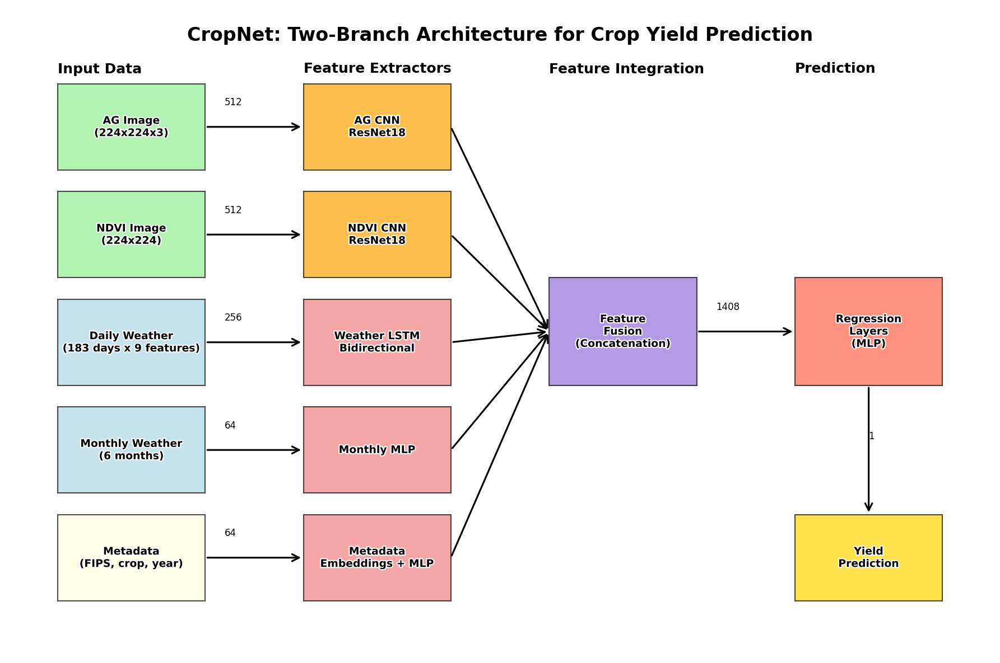

# CropNet: Crop Yield Prediction Model

A deep learning model for crop yield prediction using multi-modal data:
- Satellite imagery (AG RGB + NDVI)
- Weather time series
- Crop metadata

## Architecture

The model uses a two-branch architecture:
- **AG CNN Branch**: Processes RGB satellite images using ResNet18
- **NDVI CNN Branch**: Processes vegetation index images using modified ResNet18
- **Weather Processing**: LSTM or Transformer for temporal weather data
- **Feature Fusion**: Combines all modalities for yield prediction



## Dataset

The dataset contains:
- USA samples across 4 crop types (Corn, Soybean, Winter Wheat, Cotton)
- AG images: RGB satellite imagery (224×224×3)
- NDVI images: Vegetation index (224×224)
- Daily weather: 183 days × 9 features (temperature, precipitation, etc.)
- Monthly weather: 6 months of aggregated climate data
- Yield values: Ground truth for training

## Getting Started

### Prerequisites

```bash
pip install torch torchvision numpy pandas matplotlib tqdm scikit-learn
```

**For GPU support** (recommended):
```bash
pip install torch torchvision --index-url https://download.pytorch.org/whl/cu121
```

## Quick Start

### 1. Generate Dataset

Generate a new dataset (optional - datasets already exist):
```bash
python create_cropnet_dataset.py
```

This creates:
- `cropnet_dataset/` - Default 2,500 samples
- `cropnet_dataset2/` - 5,000 samples (if modified)

### 2. Train the Model

**Basic Training (with default settings):**
```bash
python train_cropnet.py
```

**Training with custom parameters:**
```bash
python train_cropnet.py \
    --data_dir ./cropnet_dataset2 \
    --batch_size 64 \
    --num_epochs 5 \
    --lr 0.0005 \
    --weather_processor lstm \
    --save_dir ./cropnet_models2
```

**Training Parameters:**
- `--data_dir`: Path to dataset directory (default: `./cropnet_dataset`)
- `--batch_size`: Batch size for training (default: 64)
- `--num_epochs`: Number of training epochs (default: 50)
- `--lr`: Initial learning rate (default: 0.001)
- `--weather_processor`: Choose 'lstm' (default) or 'transformer'
- `--save_dir`: Directory to save models (default: `./models`)
- `--patience`: Early stopping patience (default: 10)
- `--weight_decay`: L2 regularization (default: 1e-4)
- `--seed`: Random seed (default: 42)

**Training Output:**
- Models saved after each epoch in `save_dir/epoch_models/`
- Best model saved as `save_dir/best_model.pth`
- Training history in `save_dir/detailed_training_history.json`
- Training plots in `save_dir/training_history.png`

### 3. Test the Model

**Test on entire test set:**
```bash
python test_model.py \
    --model_path ./cropnet_models2/best_model.pth \
    --data_dir ./cropnet_dataset2 \
    --save_dir ./cropnet_models2
```

**Test on a single sample:**
```bash
python test_model.py \
    --model_path ./cropnet_models2/best_model.pth \
    --data_dir ./cropnet_dataset2 \
    --sample_idx 0
```

**Testing Parameters:**
- `--model_path`: Path to trained model (default: `./cropnet_models/best_model.pth`)
- `--data_dir`: Path to dataset directory (default: `./cropnet_dataset`)
- `--save_dir`: Directory to save test results (default: `./cropnet_models`)
- `--weather_processor`: Must match training ('lstm' or 'transformer')
- `--sample_idx`: Test on specific sample (optional)

**Test Output:**
- `test_predictions.json` - All predictions with metrics
- `test_predictions_plot.png` - Visualization of predictions vs. true values
- Metrics displayed: R² Score, RMSE, MAE, MSE

## Example Commands

### Full Training and Testing Workflow

```bash
# 1. Train model on dataset2 (5000 samples)
python train_cropnet.py \
    --data_dir ./cropnet_dataset2 \
    --batch_size 64 \
    --num_epochs 5 \
    --lr 0.0005 \
    --save_dir ./cropnet_models2

# 2. Test the trained model
python test_model.py \
    --model_path ./cropnet_models2/best_model.pth \
    --data_dir ./cropnet_dataset2 \
    --save_dir ./cropnet_models2
```

### Quick Test (using existing model)

```bash
python test_model.py --model_path ./cropnet_models2/best_model.pth
```

## Model Performance

### Current Results :
- **R² Score**: 0.9642 (96.42% accuracy)
- **RMSE**: 0.1886
- **MAE**: 0.1114
- **MSE**: 0.0356

### Model Components

- `cropnet_model.py`: Model architecture definition
- `cropnet_dataset.py`: PyTorch dataset for loading data
- `train_cropnet.py`: Training and evaluation script
- `test_model.py`: Model testing and inference script
- `create_cropnet_dataset.py`: Dataset generation script

## Results Files

After training and testing, you'll find:
- `save_dir/best_model.pth` - Best performing model
- `save_dir/epoch_models/model_epoch_X.pth` - Models from each epoch
- `save_dir/test_predictions.json` - Test predictions and metrics
- `save_dir/test_predictions_plot.png` - Prediction visualization
- `save_dir/training_history.png` - Training curves
- `save_dir/detailed_training_history.json` - Complete training metrics

## Troubleshooting

**GPU not detected:**
- Install CUDA-enabled PyTorch: `pip install torch torchvision --index-url https://download.pytorch.org/whl/cu121`
- Verify: `python -c "import torch; print(torch.cuda.is_available())"`

**Out of memory:**
- Reduce batch size: `--batch_size 32` or `--batch_size 16`

**Slow training:**
- Ensure GPU is being used (check "Using device: cuda" message)
- Increase batch size if GPU memory allows
- Reduce number of workers: `--num_workers 2`

## Citation

```
@misc{cropnet2026,
  author = {Yash Patil},
  title = {CropNet: Crop Yield Prediction Using Multi-Modal Deep Learning},
  year = {2026},
  publisher = {GitHub},
  howpublished = {\url{https://github.com/yashpatil4904/Crop-Insurance-System-using-satellite-imagery-and-blockchain}}
}
```

